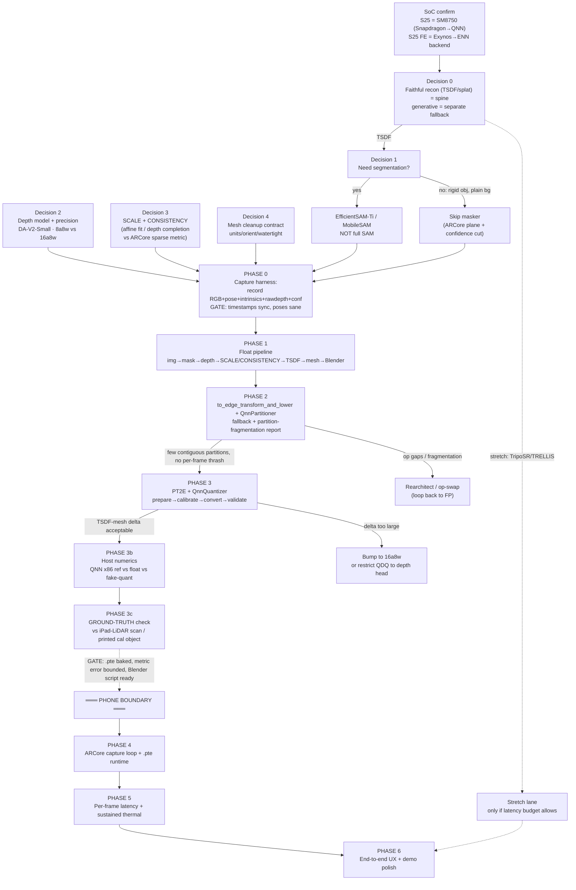
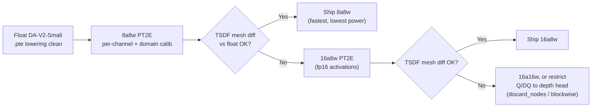

# Phone Scan → 3D — Execution Roadmap (S25 / Hexagon)

**Strategic spine (locked):** TSDF fusion of ARCore-aligned depth maps is the reconstruction backbone. Depth Anything V2 Small (relative) is the depth net; an optional EfficientSAM-Ti / MobileSAM masker is used only when the background isn't trivially separable. Learned image-to-3D (TripoSR / TRELLIS class) is an explicit **stretch** that earns effort only once the TSDF path is proven end-to-end on host and lowered to `.pte`.

**Why front-load:** roughly 80% of the de-risking — the float pipeline, the QNN partitioner op-coverage report, and PT2E quantization validation — happens on a workstation before the phone is unboxed, because QNN lowering, partitioning, and quantization are all ahead-of-time and host-side against the Qualcomm AI Engine Direct (QNN) SDK.

**Target device:** Galaxy S25 / S25+ / S25 Ultra → **Snapdragon 8 Elite for Galaxy = SM8750** (Adreno 830 GPU, Hexagon NPU), used across all global S25 SKUs. *Not* SM8850 (that's the S26 / 8 Elite Gen 5). The only S25-family exception is the **S25 FE**, which ships an Exynos part — if that's your unit, the entire QNN lane is wrong and you need ExecuTorch's Samsung ENN backend instead. **Confirm the SoC before Phase 2.**

---

## 0. The dependency DAG (critical path)

The dashed line is the **host→phone boundary**: nothing below it starts until everything above is green.



---

## 1. Phase roadmap (master table)

| Phase | Window | Deliverable | Host/Phone | Top risk | Exit criteria |
|---|---|---|---|---|---|
| **P0a — Decisions locked** | Day 0 (½ day) | Signed answers to 5 decision points + mesh contract doc + confirmed SoC | Host | Wrong spine / wrong chip wastes everything | DAG agreed; `QcomChipset.SM8750` present in build |
| **P0b — Capture harness** | Day 0–1 | App/replay loader recording synced RGB + pose + intrinsics + raw depth + confidence to disk; sync/pose validator | Host+phone | Bad captures silently poison everything downstream | Recorded session replays with aligned timestamps and a sane trajectory |
| **P1 — Float pipeline** | Days 1–4 | `pipeline_float.py`: image→mask→depth→**scale/consistency**→TSDF→mesh→Blender, on 3 real objects | Host | Concept doesn't hold even in float | Clean, correctly-scaled mesh imports to Blender on 3 objects |
| **P2 — QNN lowering + coverage** | Days 3–5 (parallel) | `.pte` for depth (+masker); partitioner fallback **and fragmentation** report; op-swap log | Host | Unsupported op / silent CPU fragmentation kills latency | Depth net lowers to few contiguous QNN partitions, no per-frame CPU↔NPU thrash |
| **P3 — PT2E quantization** | Days 5–7 | `8a8w` and `16a8w` variants; host numerics delta report | Host | Quantization compresses depth scale → TSDF artifacts | TSDF-mesh diff (not depth MAE) within threshold for one variant |
| **P3b — Host numerics** | Day 7 | QNN x86 ref vs float vs fake-quant; quantized-depth mesh diff | Host | Host hides a bug that only shows on Hexagon | Quantized-depth mesh ≈ float-depth mesh on cal objects |
| **P3c — Ground truth** | Day 7 | Metric error vs reference (iPad LiDAR scan or printed known-dimension object) | Host | Float pipeline is internally consistent but metrically *wrong* | Mesh dimensional error within stated bound |
| **P4 — Phone integration** | Phone Day 1 | ARCore Raw Depth + pose loop; `.pte` via ExecuTorch runtime; live depth+mask→TSDF→mesh | Phone | `.pte` load fail / on-device numerics mismatch | Live preview grows a mesh on screen |
| **P5 — Profiling** | Phone Day 1–2 | Per-stage latency; sustained thermal throughput; Hexagon-vs-host numerics | Phone | Thermal throttling collapses framerate | ≥10 fps sustained 90 s, <30% latency regression |
| **P6 — UX + demo** | Phone Day 2–3 | One-tap scan→export; demo reel; **fallback video** | Phone | Live demo fails | Reproducible 30 s scan→editable mesh |
| **Stretch — Learned recon** | Only if P5 has headroom | TripoSR/TRELLIS as a bonus mode | Host→Phone | — | Optional; never blocks TSDF demo |

---

## 2. The five decision points, resolved

**Decision 0 — Faithful recon vs generative.** These solve *different* problems, so they are not a true fork: TSDF/splat **faithfully fuses what you scanned**; TripoSR/TRELLIS **hallucinate a plausible complete object from sparse views**. The spine is faithful recon. The only on-device networks are depth and (optionally) segmentation — both small and well-supported in ExecuTorch's QNN backend. Generative recon is a parallel stretch (and the most likely to carry unsupported ops and blow the latency budget); it gets effort only after the TSDF path is green through P5.

**Decision 1 — Segmentation.** Default to **skipping** it for a single rigid object on a plain surface — ARCore's plane detection plus the raw-depth confidence map is often enough to cut background. If you need a masker, use **EfficientSAM-Ti (~9.8M params)** or **MobileSAM** — never full SAM or FastSAM. EfficientSAM has a released TorchScript variant, a strong signal it traces cleanly for export. Mask the **depth map per frame before TSDF integration** (not the RGB) so bad pixels never enter the volume.

**Decision 2 — Depth model and precision.** **Depth Anything V2 Small** (DINOv2 backbone + DPT head, ~25M params) is the candidate. The open question — survives `8a8w`, or needs `16a8w` to keep depth scale usable for fusion — is fully answerable offline. QnnQuantizer supports `8a8w` (default), `16a8w`, `16a16w`, and `16a4w`, so both candidates are first-class. **Known export hazard:** DA-V2's `interpolate_pos_encoding` and dynamic input shapes break `torch.export`; patch to a fixed-shape, traceable variant *before* lowering.

**Decision 3 — Scale and multi-view consistency (the crux).** This is the single highest-value algorithmic component and it was a one-line afterthought in the prior draft. It is its own sub-pipeline. **ARCore poses + relative depth, with scale recovered from ARCore's sparse metric depth.** Two correctness points the naive version gets wrong:

- **DA-V2 relative depth is *affine*-invariant — scale *and* shift are both unknown.** A scale-only fit (`metric = s · rel`) systematically **bends flat surfaces**, because it leaves the shift term unsolved. You must fit `metric_disparity ≈ s · pred_disparity + t` (least squares in disparity / inverse-depth space) against ARCore's confident metric samples, robustly (Huber or RANSAC, to reject ARCore's edge-bleed outliers).
- **Monocular depth is not multi-view consistent.** Even perfectly affine-aligned, one frame's geometry won't fully agree with the next's, so TSDF averaging thickens and blurs surfaces. Mitigation order: (1) solve **one global `s`** across the sequence (same model, same lens — scale is stable) with only a small **per-frame `t`, temporally smoothed**; (2) confidence- and view-angle-weight each depth sample into the volume; (3) if that's not enough, switch from "align then fuse" to **depth completion** — treat ARCore's sparse metric points as the consistent *skeleton* and use DA-V2's dense prediction only as the *guide* that interpolates between them (guided/joint-bilateral upsampling). Completion gets scale, consistency, and textureless-hole-filling in one move, and is the recommended Phase-1 target if the affine-fit mesh shows surface drift.

A metric DA-V2 variant exists (`Depth-Anything-V2-Metric-*`) but it's lower-ROI than letting ARCore carry scale, and metric monocular depth degrades out of its training domain.

**Decision 4 — Mesh cleanup contract.** Written Day 0 so the on-device exporter and Blender import script agree:

- **Format:** `.glb` (single binary file, carries materials) primary; `.obj`+`.mtl` fallback.
- **Units:** meters, 1.0 = 1 m (matches ARCore world space).
- **Orientation:** +Y up, −Z forward (glTF). Blender default is +Z up; the import script applies the glTF rotation.
- **Watertightness:** **not guaranteed** by TSDF extraction — the Blender step *must* run a voxel remesh + `normals_make_consistent` before any CAD export.
- **Scale handling:** mesh arrives in object-local meters; import script applies a user scale (e.g. ×1000 for mm CAD).

---

## 3. Week-by-week (host phases)

### Phase 0 — Capture harness (Day 0–1)
Build the recorder first; the float pipeline is worthless against bad data. Capture per keyframe to disk: RGB, 6-DoF camera pose (`Frame.getCameraPose()`, ARCore world meters), intrinsics (`CameraIntrinsics`), ARCore **raw** depth + confidence. The raw-depth buffer is 16-bit (13-bit depth + 3-bit confidence) — wire a loader for it so the pipeline runs from *recorded sessions*, not just live capture. **Gate:** replay a recording and confirm timestamps align across streams (interpolate pose to each RGB timestamp — slerp rotation, lerp translation) and the trajectory is sane (walk a known path, check it). A round-trip projection test (project a known 3D point → unproject → assert recovery) belongs here; it catches the axis/sign/inverse-depth bugs that otherwise eat phone days.

### Phase 1 — Float pipeline (Days 1–4)
**Day 1.** Stand up depth: clone DA-V2, patch `interpolate_pos_encoding` to a traceable fixed-shape variant, load Small weights, verify single-image inference. Confirm intrinsics are rescaled by the resize ratio on every model input (wrap in one tested function — an off-by-scale intrinsic silently produces wrong geometry).

**Day 2.** TSDF fusion. Two options: **Open3D `VoxelBlockGrid`** (GPU-accelerated, depth+intrinsics+poses → marching-cubes mesh) — fastest to prototype on host; or **VDBFusion** (C++/Python, NumPy in/out, sparse VDB) — lower-friction if you want to avoid Open3D's Android build later. Prototype with Open3D; keep VDBFusion in mind for on-device.

**Day 3 — the crux.** Implement the **affine** scale/shift solver: fit `[s, t]` for `metric_disparity ≈ s · pred_disparity + t` against confidence-filtered ARCore metric points, robustly; global `s`, smoothed per-frame `t`. Feed scaled metric depth into TSDF, fusing with ARCore raw depth where confidence is high. If surfaces drift between views, escalate to depth completion (Decision 3, option 3). **This is where a shape-correct mesh comes out dimensionally wrong if done naively — do not ship the scale-only version.**

**Day 4.** Blender headless import/clean: `blender --background --python import_and_clean.py` — native glTF/OBJ import, voxel remesh, normal consistency, glB/CAD export. Prove image→mask→depth→scale→TSDF→mesh→Blender end-to-end on 3 real objects. **Exit gate: if the concept doesn't hold in float, it never holds quantized on-device.**

### Phase 2 — QNN lowering + coverage (Days 3–5, parallel)
Install the QNN SDK and ExecuTorch host tooling. **Confirm `QcomChipset.SM8750` exists in your ExecuTorch build before starting** — the enum lags new SoCs and adding a chip is a known friction point; if missing, mirror the nearest entry or patch locally.

```python
from executorch.backends.qualcomm.partition.qnn_partitioner import QnnPartitioner
from executorch.backends.qualcomm.utils.utils import (
    generate_qnn_executorch_compiler_spec,
    generate_htp_compiler_spec,
    QcomChipset,
)
from executorch.exir import to_edge_transform_and_lower

backend_options = generate_htp_compiler_spec(use_fp16=False)  # quantized
compile_spec = generate_qnn_executorch_compiler_spec(
    soc_model=QcomChipset.SM8750,          # S25 = Snapdragon 8 Elite (NOT SM8850)
    backend_options=backend_options,
)
edge = to_edge_transform_and_lower(
    exported_program,
    partitioner=[QnnPartitioner(compile_spec)],
)
pte_bytes = edge.to_executorch().buffer
```

The partitioner's **fallback report is the most important artifact of the whole project** — it tells you which ops won't run on Hexagon before you touch hardware. **But "op coverage green" is the wrong gate.** The partitioner doesn't fail on unsupported ops — it *silently fragments* the graph into delegated/CPU partitions that thrash across the NPU↔CPU boundary every frame, destroying latency even at 95% coverage. A depth ViT's interpolate/normalize ops habitually land on CPU. **Real gate: few contiguous partitions, no per-frame boundary thrash.** Unsupported nodes can also throw `KeyError` instead of falling back cleanly; use `skip_node_op_set` to deliberately leave a cheap op on the portable backend, and re-run. Fix all of this on host — never defer to phone.

### Phase 3 — PT2E quantization (Days 5–7)
PT2E with `QnnQuantizer`: `prepare → calibrate → convert → validate`. Build the calibration set now from representative scans (50–200 frames across your objects, lighting, distances) — free and required regardless. Draw it from your *actual* capture domain, not random images.

```python
from executorch.backends.qualcomm.quantizer.quantizer import QnnQuantizer
from torchao.quantization.pt2e.quantize_pt2e import prepare_pt2e, convert_pt2e

quantizer = QnnQuantizer()                       # 8a8w default; configure 16a8w for the fp16-activation variant
prepared  = prepare_pt2e(exported_program.module(), quantizer)
for batch in calibration_loader:                 # representative scans
    prepared(batch)
converted = convert_pt2e(prepared)               # inserts Q/DQ, bakes scales
```

Run **both** `8a8w` and `16a8w` and compare to float. **The metric that matters is the TSDF *mesh* diff, not pixel-wise depth MAE** — quantization that looks fine on depth L1 can still wreck fusion if it compresses the depth scale non-uniformly across range. QNN ships an x86 reference path, so run the lowered `.pte` on host and compare against float and fake-quant. **Fallback ladder (in order):** per-channel weights + domain calibration → `16a8w` (fp16 activations preserve depth scale at modest latency cost) → restrict Q/DQ to the depth-regression head via `discard_nodes` / blockwise config. **Gate: quantized-depth TSDF mesh visually indistinguishable from float-depth mesh.**

### Phase 3b — Host numerics (Day 7)
Run the full pipeline on host with the QNN x86 backend as the inference engine; confirm end-to-end mesh quality matches float. Divergence here is a desk-fixable bug; the same divergence on-device is a demo-ending emergency.

### Phase 3c — Ground truth (Day 7)
Everything above is **self-referential** — it proves quantization and runtime didn't drift from your float pipeline, *not* that the float pipeline is metrically correct. Validate against reality: scan the same objects with a LiDAR iPad (Object Capture) as pseudo-ground-truth and compute surface distance against your mesh, and/or measure a 3D-printed known-dimension calibration object directly. **Gate: mesh dimensional error within a stated bound.** This is also your honest research artifact — a calibration-and-failure study of how well a quantized monocular model stands in for a depth sensor, not a "we beat everyone" claim.

**End-of-Day-7 tag (nothing past the phone boundary starts before this exists):** all lowered `.pte` files, Blender import script, calibration set, host numerics report, ground-truth error report.

---

## 4. Phone-day playbook

The phone is needed only for real per-frame latency, sustained/thermal throughput, Hexagon-vs-host numerics confirmation, the live ARCore loop, and UX timing. Day one is **integration and profiling, not discovery.**

**Phone Day 1 — Integration.**
1. Load each `.pte` via the ExecuTorch Android runtime; single-frame inference on-device, diff against host QNN x86 output. **Diverge → stop and diagnose first** — this numerics match is the one thing only real Hexagon can confirm.
2. ARCore session: `Config.DepthMode = RAW_DEPTH_ONLY` (raw per-frame depth for scale recovery) or `AUTOMATIC` (ARCore's fused depth as primary, DA-V2 filling low-confidence regions). Request frames + poses + raw depth + confidence.
3. Live loop: `.pte` depth → affine scale recovery from ARCore sparse metric → TSDF integrate → on-device mesh preview.
4. **Gate:** a live on-screen mesh that grows as you sweep an object.

**Phone Day 1–2 — Profiling.**
5. Per-frame latency by stage: ARCore acquisition, depth inference, mask (if used), scale recovery, TSDF integrate, mesh extraction. Depth inference is the number that must hit budget.
6. **Sustained test:** 90 s continuous scan, log fps and SoC temperature. Thermal throttling is the most common reason a 10 s demo dies at 60 s. **Levers in order:** keyframe-gate depth (don't run every frame — this is an architectural choice, set it in the capture loop, not as an afterthought) → drop `16a8w`→`8a8w` → reduce input resolution → half-rate depth + interpolation → skip every other TSDF integration. Pin depth to the NPU; consider running TSDF on the Adreno GPU so fusion and depth don't contend.
7. Re-confirm Hexagon numerics under sustained load (some throttle paths change precision behavior).

**Phone Day 2–3 — UX + demo.**
8. One-tap scan→export: button → progress UI → done → mesh to storage → Blender/CAD export (on-device or shuttle the file to a laptop — fine for a demo).
9. **Record a fallback demo video the moment you get one clean run.** Live demos fail; the video is insurance.
10. (Stretch only) wire TripoSR/TRELLIS behind a toggle as a bonus mode — never the primary demo.

---

## 5. Risk register (ranked)

| # | Risk | Likelihood | Impact | Mitigation |
|---|---|---|---|---|
| R1 | DA-V2 unsupported QNN ops → CPU fragmentation, latency death | High | Critical | Partitioner report Day 3; patch `interpolate_pos_encoding`, audit DINOv2 attention; gate on partition count not op coverage |
| R2 | **Scale-only alignment bends surfaces** (shift term unsolved) | High | Critical | Fit affine `[s,t]` in disparity space, robustly; escalate to depth completion if drift persists |
| R3 | `8a8w` compresses depth scale → TSDF artifacts | Med | High | Bake `16a8w` in parallel; gate on TSDF mesh diff, not depth MAE |
| R4 | Wrong SoC enum / wrong chip assumed | Med | High | Confirmed S25 = **SM8750**; verify enum before Day 3; S25 FE is Exynos → ENN backend |
| R5 | Monocular depth multi-view-inconsistent → blurred/thick surfaces | High | Med | Confidence + view-angle weighting; global-scale fusion; depth completion against ARCore skeleton |
| R6 | Float pipeline metrically wrong but internally consistent | Med | High | Phase 3c ground-truth check vs iPad LiDAR / printed cal object |
| R7 | Hexagon numerics diverge from host x86 QNN | Med | High | Phone Day-1 step 1 catches it; keep float and `16a16w` fallbacks |
| R8 | Thermal throttling collapses sustained fps | High | Med | Keyframe-gate depth (architectural); half-rate + interpolation; reduce resolution; profile Day 1 |
| R9 | ARCore raw depth low-confidence on object surface | Med | Med | Fall back to ARCore fused depth, or DA-V2 + pose-only scale on a fiducial marker |
| R10 | TSDF mesh not watertight → CAD import breaks | High | Med | Voxel remesh in headless bpy is mandatory, not optional |
| R11 | Phone arrives late | Med | High | Contingency below |

---

## 6. Phone-late contingency

Don't idle. Use the buffer to:
- **Record full ARCore sessions** from any Depth-API-supported loaner (even an older Galaxy) as a replay harness, exercising the entire on-device code path minus real Hexagon. ARCore raw depth works on any supported device, not just SM8750.
- **Stress the partitioner** against `16a4w` and the stretch generative models, so you know their op-coverage shape now.
- **Build demo-reel scaffolding** (screen-record scripts, before/after mesh comparisons, Blender import timelapse) so the first good on-device scan assembles itself.
- **Pre-integrate the ExecuTorch Android runtime** into the app shell with a stub depth model, so phone Day 1 is "swap stub for real `.pte`," not "wire up the runtime."

---

## 7. Module reference cards

### Card A — Float pipeline skeleton
```
frame (RGB, pose, raw_depth, confidence, intrinsics)
  │
  ├─► [optional] EfficientSAM-Ti / MobileSAM  →  mask            (skip if plain bg)
  │
  ├─► Depth Anything V2 Small (relative)      →  pred_disparity  (affine-invariant)
  │
  ├─► robust lstsq over conf>τ samples:
  │       metric_disparity ≈ s·pred_disparity + t   ← solve s AND t (global s, smoothed t)
  │
  ├─► metric_depth = 1 / (s·pred_disparity + t)
  │       fuse with raw_depth where confidence high   (or depth-completion against sparse skeleton)
  │
  └─► Open3D VoxelBlockGrid / VDBFusion.integrate(metric_depth, intrinsics, pose)
                                                           │
                                                  marching cubes → mesh (.glb)
                                                           │
                                       blender --background --python import_and_clean.py
```

### Card B — QNN lowering (coverage-first)
Read the partitioner fallback report immediately after `to_edge_transform_and_lower`. Any op in the fallback list is a future phone-day fire, and **fragmentation matters more than coverage percentage** — many small partitions = per-frame CPU↔NPU thrash = dead latency. Common DA-V2 gotchas: dynamic shapes in `interpolate_pos_encoding` (fix to fixed-shape), attention/softmax variants that may need `skip_node_op_set` to fall back without `KeyError`. Iterate on host until the report shows few contiguous QNN partitions.

### Card C — PT2E quantization decision tree

Gate is always **TSDF mesh diff**, never raw depth MAE.

### Card D — Mesh cleanup contract (Blender headless)
```python
# import_and_clean.py — blender --background --python import_and_clean.py -- input.glb output.glb
import bpy, sys
bpy.ops.wm.read_factory_settings(use_empty=True)
bpy.ops.import_scene.gltf(filepath=sys.argv[-2])     # glTF importer handles +Y-up → +Z-up rotation
obj = bpy.context.selected_objects[0]
# Contract: input meters, glTF orientation.
obj.scale = (1000.0, 1000.0, 1000.0)                 # m → mm for CAD
bpy.ops.object.transform_apply(location=False, rotation=False, scale=True)
# Watertightness (TSDF output is NOT guaranteed watertight) — mandatory:
bpy.context.view_layer.objects.active = obj; obj.select_set(True)
mod = obj.modifiers.new(name="VoxelRemesh", type='REMESH'); mod.mode = 'VOXEL'; mod.voxel_size = 0.5
bpy.ops.object.modifier_apply(modifier="VoxelRemesh")
bpy.ops.object.mode_set(mode='EDIT'); bpy.ops.mesh.select_all(action='SELECT')
bpy.ops.mesh.normals_make_consistent(inside=False)
bpy.ops.object.mode_set(mode='OBJECT')
bpy.ops.export_scene.gltf(filepath=sys.argv[-1], export_format='GLB')
```
Non-negotiables: voxel remesh + `normals_make_consistent` (CAD tools reject flipped normals).

### Card E — ARCore integration notes
- `RAW_DEPTH_ONLY` for raw per-frame depth used in scale recovery; `AUTOMATIC` if you want ARCore's fused (depth-from-motion) depth as primary and DA-V2 as low-confidence fill.
- Raw-depth buffer is 16-bit: 13-bit depth + 3-bit confidence — filter to confidence ≥ threshold before using for the affine fit.
- Poses from `Frame.getCameraPose()` are ARCore world meters → your TSDF poses directly. Intrinsics from `CameraIntrinsics` (rescale per model input).
- Scale needs **translational** motion (parallax). Pure rotation gives zero baseline → zero scale; reject takes with insufficient inter-keyframe translation. A printed **fiducial of known size** in-scene gives absolute scale directly and also anchors pose against drift — strongly recommended if accuracy matters.
- ARCore depth is sparse and noisy at object scale; that's exactly why DA-V2 (dense, smooth) + ARCore (sparse, metric) is the right pairing — DA-V2 gives the dense surface, ARCore gives the meter.

---

The roadmap stays deliberately front-loaded: every host gate (capture validity, float pipeline, partitioner/fragmentation report, quantization delta, host numerics, ground truth) exists to make the phone phase pure integration-and-profiling, not discovery. The generative-recon lane runs in parallel only after P5 proves latency headroom, and never touches the TSDF critical path.