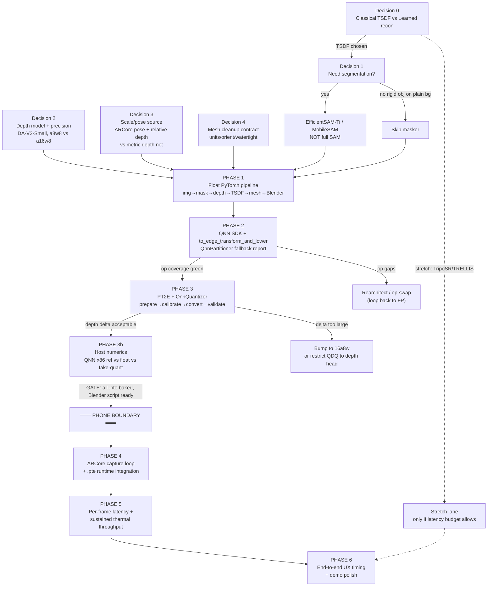
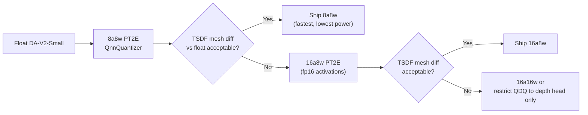

Below is the full execution roadmap. The strategic spine is locked in from the start: **TSDF fusion of ARCore-aligned depth maps is the reconstruction backbone, with Depth Anything V2 Small (relative) as the depth net and an optional EfficientSAM/MobileSAM masker; learned image-to-3D is explicitly a stretch goal that only earns effort once the TSDF path is proven end-to-end on host and lowered to `.pte`.** Roughly 80% of de-risking — the float pipeline, the QNN partitioner op-coverage report, and PT2E quantization validation — happens on your workstation before the phone is ever unboxed, because the QNN lowering, partitioning, and quantization are all ahead-of-time and host-side against the Qualcomm AI Engine Direct (QNN) SDK【turn0search1】【turn0search3】.

## 0. The dependency DAG (your critical path)

This is the order in which decisions and deliverables gate each other. The dashed line is the **host→phone boundary**: nothing below it can be started until everything above it is green.



---

## 1. Phase roadmap (the master table)

| Phase | Window | Deliverable | Owner | Host/Phone | Top risk | Exit criteria |
|---|---|---|---|---|---|---|
| **P0 — Decisions locked** | Day 0 (½ day) | Signed-off answers to the 5 decision points; mesh cleanup contract doc | Tech lead | Host | Wrong spine choice wastes everything | DAG above agreed by whole team |
| **P1 — Float pipeline** | Days 1–4 | `pipeline_float.py`: image→mask→depth→TSDF→mesh→Blender import, working on 3 real objects on laptop GPU | Recon eng | Host | Concept doesn't hold in float | Clean mesh imports into Blender on 3 objects |
| **P2 — QNN lowering + op coverage** | Days 3–5 (parallel w/ P1 tail) | `to_edge_transform_and_lower` → `.pte` for depth (+masker); partitioner fallback report; op-swap log | Edge eng | Host | Unsupported op kills the net (most common death) | 100% of depth net subgraph delegates to QNN, zero CPU fallback |
| **P3 — PT2E quantization** | Days 5–7 | QnnQuantizer prepare→calibrate→convert; a8w8 and a16w8 variants; host numerics delta report | Edge eng | Host | Quantization destroys depth scale → TSDF artifacts | a8w8 depth-vs-float L1 rel error < threshold OR a16w8 fallback proven |
| **P3b — Host numerics validation** | Day 7 | QNN x86 reference path output vs float vs fake-quant; TSDF-on-quantized-depth mesh diff | Edge + Recon | Host | Host numerics hide a bug that surfaces on Hexagon | Quantized-depth mesh visually indistinguishable from float-depth mesh |
| **P4 — Phone integration** | Phone Day 1 | ARCore Raw Depth + pose capture loop; `.pte` loaded via ExecuTorch runtime; live depth+mask→TSDF→mesh | Android eng + Recon | Phone | `.pte` fails to load on device / numerics mismatch | Live preview produces a growing mesh on screen |
| **P5 — Profiling** | Phone Day 1–2 | Per-frame latency breakdown; sustained throughput under thermal; Hexagon numerics vs host | Edge eng | Phone | Thermal throttling collapses framerate below real-time | ≥10 fps sustained for 90 s without >30% latency regression |
| **P6 — UX + demo** | Phone Day 2–3 | One-tap scan→Blender/CAD export; demo reel; fallback demo video | All | Phone | Demo fails live | Reproducible 30-s scan→editable-mesh demo |
| **Stretch — Learned recon** | Only if P5 has headroom | TripoSR/TRELLIS lowered as a "bonus mode" | 1 eng | Host→Phone | — | Optional; never blocks the TSDF demo |

---

## 2. The five decision points, resolved

**Decision 0 — Classical vs learned.** TSDF fusion of depth maps is the spine. The only on-device networks are depth and (optionally) segmentation — both small and well-supported in ExecuTorch's QNN backend【turn0search1】. A feedforward image-to-3D model (TripoSR / InstantMesh / TRELLIS class) is the flashy path but is the model most likely to have unsupported ops and blow the latency budget; treat it as a stretch that only gets effort once the TSDF path is green through P5.

**Decision 1 — Segmentation.** Default to **skipping** it for a single rigid object on a plain surface — ARCore Raw Depth's confidence map plus a simple background-plane cut (from ARCore's plane detection) is often enough. If you need a masker, use **EfficientSAM-Ti (9.8M params)** or **MobileSAM** — never full SAM or FastSAM (68M)【turn0search15】【turn0search16】. EfficientSAM has a released TorchScript variant, which is a strong signal it traces cleanly for export【turn0search14】.

**Decision 2 — Depth model and precision.** **Depth Anything V2 Small** (~94.6 MB, DINOv2 backbone + DPT head) is the candidate【turn2search8】. The real question is whether it survives **8a8w** or needs **16a8w** to keep scale consistency usable for fusion — and this is fully answerable offline. The QnnQuantizer supports `8a8w` (default), `16a8w`, `16a16w`, and `16a4w`, so both candidates are first-class options【turn0search1】【turn4find1】. Expect friction: DA-V2's `interpolate_pos_encoding` and dynamic input shapes are known export hazards that need to be replaced with a traceable variant before `torch.export` will succeed【turn0search11】.

**Decision 3 — Scale/pose source.** **ARCore poses + relative depth, with relative-depth scale recovered from ARCore's metric sparse depth.** ARCore's Raw Depth API gives per-frame depth + a confidence map and works without a ToF sensor by fusing depth-from-motion, so it is available on the Galaxy class devices you're targeting【turn1search0】【turn1search1】. Use ARCore's sparse metric depth to solve for the scale factor that maps DA-V2's relative depth into metric units per frame; this gives a dimensionally meaningful mesh without a metric depth net. A metric DA-V2 variant exists (e.g. `Depth-Anything-V2-Metric-Outdoor-Small-hf`)【turn2search7】 but it's a lower-ROI path than letting ARCore carry scale.

**Decision 4 — Mesh cleanup contract.** Define this in a one-page doc on Day 0 so the on-device exporter and the Blender import script agree. Recommended contract:

- **Format**: `.glb` (single file, binary, carries materials) as primary; `.obj`+`.mtl` as fallback.
- **Units**: meters, 1.0 unit = 1 m (matches ARCore).
- **Orientation**: +Y up, −Z forward (GLTF convention); Blender's default is +Z up, so the import script applies the GLTF rotation.
- **Watertightness**: **not guaranteed** by TSDF extraction; the Blender step must run a remesh (Voxel remesh or `bpy.ops.object.modifier_add(type='REMESH')` voxel mode) + `bpy.ops.mesh.normals_make_consistent()` before any CAD export.
- **Scale handling**: mesh arrives in object-local meters; import script applies a user scale factor (e.g. ×1000 for mm CAD workflows).

---

## 3. Week-by-week (host phases, pre-phone)

### Phase 1 — Float pipeline (Days 1–4)

**Day 1.** Stand up the depth model: clone DA-V2, patch `interpolate_pos_encoding` to a traceable variant, load the Small weights, and verify inference on a still image【turn0search11】. In parallel, wire ARCore's Raw Depth sample format (16-bit buffer = 13-bit depth + 3-bit confidence) into a synthetic frame loader so your pipeline can be fed from recorded ARCore sessions, not just live capture【turn1search3】.

**Day 2.** Integrate TSDF fusion. Two pragmatic options: **Open3D's `VoxelBlockGrid` TSDF integration** (GPU-accelerated, takes depth + intrinsics + poses, outputs a mesh via marching cubes)【turn1search5】, or **VDBFusion** (C++/Python, NumPy in/out, sparse VDB, trivially pluggable)【turn1search6】【turn1search7】. For a hackathon, VDBFusion's NumPy interface is the lower-friction choice if you want to avoid Open3D's build on Android later; Open3D is faster to prototype with on host.

**Day 3.** Depth→scale recovery: implement the least-squares solver that fits `s` in `metric = s · relative_depth` against ARCore's sparse metric depth samples (filtered by confidence ≥ threshold). Feed the scaled depth into TSDF. This is the single highest-value algorithmic step — if the mesh comes out shape-correct but dimensionally wrong, this is where it breaks.

**Day 4.** Blender headless import script: `blender --background --python import_and_clean.py`, using the native OBJ/GLB importer via `bpy`, then voxel remesh + normal consistency + GLB/CAD export【turn1search10】【turn1search11】【turn1search14】. Prove images→mask→depth→TSDF→mesh→Blender import works end-to-end on 3 real objects. **This is the Phase 1 exit gate: if the concept doesn't hold in float, it will never hold quantized on-device.**

### Phase 2 — QNN lowering + op coverage (Days 3–5, parallel)

Install the **Qualcomm AI Engine Direct (QNN) SDK** and ExecuTorch host tooling. The target SoC for the latest Galaxy class device is the **Snapdragon 8 Elite Gen 5 = SM8850** (QNN opset 87, QNN v81)【turn1search15】【turn5search2】; confirm `QcomChipset.SM8850` (or the nearest enum entry — the enum lags new SoCs, and adding a chip is a known friction point)【turn2search0】 is present in your ExecuTorch build before you start.

Run `to_edge_transform_and_lower` with the `QnnPartitioner` targeting the gen-5 SoC:

```python
from executorch.backends.qualcomm.partition.qnn_partitioner import QnnPartitioner
from executorch.backends.qualcomm.utils.utils import (
    generate_qnn_executorch_compiler_spec,
    generate_htp_compiler_spec,
    QcomChipset,
)
from executorch.exir import to_edge_transform_and_lower

backend_options = generate_htp_compiler_spec(
    soc_model=QcomChipset.SM8850,  # verify this enum entry exists in your build
)
compile_spec = generate_qnn_executorch_compiler_spec(
    soc_model=QcomChipset.SM8850,
    backend_options=backend_options,
)
edge = to_edge_transform_and_lower(
    exported_program,
    partitioner=[QnnPartitioner(compile_spec)],
)
pte_bytes = edge.to_executorch().buffer
```

The partitioner's **fallback report** is the single most important artifact of the whole project — it tells you exactly which ops won't run on Hexagon before you touch hardware【turn0search1】. This is where these projects usually die: unsupported nodes (e.g. `aten._adaptive_avg_pool3d`, `aten.div.Tensor_mode`, `aten.flip`, `aten.max_pool3d_with_indices`, and various log/pool variants) can throw `KeyError` instead of cleanly falling back【turn2search3】. **Phase 2 exit gate: 100% of the depth net's compute subgraph delegates to QNN with zero CPU fallback.** If there are gaps, swap ops now (e.g. replace an unsupported pool with a supported one, or use `skip_node_op_set` to deliberately leave a cheap op on the portable backend) and re-run — do not defer this to the phone.

### Phase 3 — PT2E quantization (Days 5–7)

Use **PT2E with the `QnnQuantizer`**: `prepare` → `calibrate` → `convert` → validate【turn0search8】【turn0search5】. Build the calibration set now from representative object scans (50–200 frames across your test objects, lighting conditions, distances) — this is free and you need it regardless.

```python
# Pseudo: PT2E + QnnQuantizer for Depth Anything V2 Small
from executorch.backends.qualcomm.quantizer import QnnQuantizer
from torchao.quantization import quantize_pt2e, convert_pt2e, prepare_pt2e

quantizer = QnnQuantizer()                       # 8a8w default
# For the 16a8w variant, configure the quantizer to keep activations fp16
pt2e_prepared = prepare_pt2e(exported_program, quantizer)
# Calibrate: run representative scans through pt2e_prepared
for batch in calibration_loader:
    pt2e_prepared(batch)
pt2e_converted = convert_pt2e(pt2e_prepared)     # inserts Q/DQ, bakes scales
```

Run **two variants** — `8a8w` and `16a8w` — and compare each against float on the host. The metric that matters is not pixel-wise depth MAE in isolation; it is **the TSDF mesh diff** between float-depth-fused and quantized-depth-fused meshes. Quantization that looks fine on a depth-map L1 metric can still wreck TSDF fusion if it compresses the depth scale non-uniformly. QNN ships an **x86 reference path**, so you can run the lowered `.pte` on host and compare its numerics against both float and fake-quant【turn0search1】. **Phase 3 exit gate: quantized-depth TSDF mesh is visually indistinguishable from float-depth TSDF mesh on the calibration objects.** If `8a8w` fails this, fall back to `16a8w` (activations stay fp16, which preserves depth scale far better at a modest latency cost).

### Phase 3b — Host numerics validation (Day 7)

Before declaring the `.pte` files baked, run the full pipeline on host with the QNN x86 backend as the depth/mask inference engine and confirm end-to-end mesh quality matches the float pipeline. Any divergence here is a bug you can fix at your desk; the same divergence on-device is a demo-ending emergency. **At the end of Day 7, the following must be committed and tagged: all lowered `.pte` files, the Blender import script, the calibration set, and a host-side numerics report. Nothing below the phone boundary starts until this tag exists.**

---

## 4. Phone-day playbook (the strict checklist)

The phone is only needed for: real per-frame latency, sustained/thermal throughput, confirmation that host numerics match Hexagon, the live ARCore capture loop, and end-to-end UX timing. Have everything lowered and the Blender script ready so day-one on the device is **integration and profiling, not discovery**.

**Phone Day 1 — Integration (no profiling yet).**
1. Load each `.pte` via the ExecuTorch Android runtime; run a single-frame inference on-device and diff the output against the host QNN x86 output. **If they diverge, stop and diagnose before anything else** — this is the numerics-match confirmation that only the real Hexagon can give you.
2. Stand up the ARCore session: configure `Config.DepthMode` to `RAW_DEPTH_ONLY` (or `AUTOMATIC` if you want ARCore's fused depth as a fallback), request camera frames + poses + raw depth + confidence maps【turn1search0】【turn1search1】.
3. Wire the live frame loop to the `.pte` depth inference → scale recovery from ARCore sparse metric depth → VDBFusion/Open3D TSDF integration → on-device mesh preview.
4. **Exit gate for Day 1**: a live on-screen mesh that grows as you sweep around an object.

**Phone Day 1–2 — Profiling.**
5. Instrument per-frame latency broken down by stage: ARCore frame acquisition, depth inference, mask inference (if used), scale recovery, TSDF integration, mesh extraction. The depth inference number is the one that must hit your budget.
6. Run a **sustained-throughput test**: 90 seconds of continuous scanning, log framerate and SoC temperature. Hexagon thermal throttling is the most common reason a demo that works for 10 seconds falls apart at 60. If sustained fps drops below your real-time threshold, the levers are (in order): drop to `8a8w` if you were on `16a8w`, reduce input resolution, run depth at half framerate and interpolate, or skip every other TSDF integration.
7. Re-confirm Hexagon numerics under sustained load (some throttle paths change precision behavior).

**Phone Day 2–3 — UX + demo.**
8. One-tap scan→export: scan button → progress UI → "done" → mesh written to storage → Blender/CAD export via the headless script (run on-device or shuttle the file to a laptop for the Blender step — the latter is fine for a hackathon demo).
9. Record a **fallback demo video** of a clean scan the moment you have one good run. Live demos fail; the video is your insurance.
10. (Stretch only, if P5 has headroom) wire TripoSR/TRELLIS as a "bonus mode" behind a toggle — never as the primary demo.

---

## 5. Risk register (ranked)

| # | Risk | Likelihood | Impact | Mitigation | Owner |
|---|---|---|---|---|---|
| R1 | DA-V2 has unsupported QNN ops that force CPU fallback | High | Critical | Run partitioner report on Day 3; pre-emptively patch `interpolate_pos_encoding` and audit DINOv2 attention ops【turn0search11】【turn2search3】 | Edge eng |
| R2 | `8a8w` quantization destroys depth scale → TSDF artifacts | Med | High | Bake `16a8w` variant in parallel; gate on TSDF mesh diff, not depth MAE【turn0search1】 | Edge eng |
| R3 | `QcomChipset.SM8850` not in your ExecuTorch build's enum | Med | High | Check enum before Day 3; if missing, patch the enum locally (mirror an adjacent SoC) or target the closest available chip【turn2search0】 | Edge eng |
| R4 | Hexagon numerics diverge from host x86 QNN | Med | High | Day-1 phone step 1 catches this; keep float and `16a16w` variants as fallbacks | Edge eng |
| R5 | Thermal throttling collapses sustained fps below real-time | High | Med | Half-framerate depth + interpolation; reduce input resolution; profile early on Day 1【turn5search2】 | Edge eng |
| R6 | ARCore Raw Depth not available / low confidence on target object surface | Med | Med | Fall back to ARCore fused depth or to DA-V2 depth alone with pose-only scale | Android eng |
| R7 | TSDF mesh not watertight → Blender/CAD import breaks | High | Med | Voxel remesh in the headless bpy step is mandatory, not optional【turn1search11】 | Recon eng |
| R8 | Phone arrives late | Med | High | Phone-day contingency below | Tech lead |

---

## 6. Phone-late contingency

If the device isn't in hand when the host phases finish, do not idle. Use the buffer to:
- **Record a full ARCore session** from any ARCore-supported loaner device (even an older Galaxy) and use it as a replay harness so the entire on-device code path — minus the real Hexagon — can be exercised on the emulator/host. The Raw Depth API works on any Depth-API-supported device, not just the gen-5 target【turn1search0】.
- **Stress-test the partitioner** against more aggressive quantization schemes (`16a4w`) and against the stretch learned-recon models, so you know their op-coverage shape now rather than discovering it on-phone.
- **Build the demo reel scaffolding** (screen recording scripts, before/after mesh comparisons, the Blender import timelapse) so that the moment you have one good on-device scan, the demo assembles itself.
- **Pre-integrate the ExecuTorch Android runtime** into the app shell with a stub depth model, so phone Day 1 is purely "swap stub for real `.pte`," not "wire up the runtime from scratch."

---

## 7. Module reference cards

### Card A — Float pipeline skeleton

```
frame (RGB, pose, raw_depth, confidence)
  │
  ├─► [optional] EfficientSAM-Ti / MobileSAM  →  mask          (skip if plain bg)
  │
  ├─► Depth Anything V2 Small (relative)      →  rel_depth
  │
  ├─► scale = lstsq(rel_depth[mask], raw_depth[conf>τ])   ← ARCore carries metric scale
  │
  ├─► metric_depth = s · rel_depth   (fused with raw_depth where conf high)
  │
  └─► VDBFusion / Open3D VoxelBlockGrid.integrate(metric_depth, intrinsics, pose)
                                                           │
                                                           ▼
                                              marching cubes → mesh (.glb)
                                                           │
                                                           ▼
                                    blender --background --python import_and_clean.py
```

### Card B — QNN lowering (op-coverage-first)

The non-negotiable is reading the partitioner's fallback report immediately after `to_edge_transform_and_lower`【turn0search1】. Any op in the fallback list is a future phone-day fire. Common DA-V2 gotchas: dynamic shapes in `interpolate_pos_encoding` (replace with a fixed-shape variant)【turn0search11】, and attention/softmax variants that may need `skip_node_op_set` to fall back cleanly rather than throw `KeyError`【turn2search3】. Iterate on the host until the report is clean.

### Card C — PT2E quantization decision tree



The gate is always **TSDF mesh diff**, never raw depth MAE — a depth map that looks fine pixel-wise can still produce a degraded mesh if quantization compresses the scale non-uniformly across the depth range.

### Card D — Mesh cleanup contract (Blender headless)

```python
# import_and_clean.py — run: blender --background --python import_and_clean.py -- input.glb output.glb
import bpy, sys
bpy.ops.wm.read_factory_settings(use_empty=True)
bpy.ops.import_scene.gltf(filepath=sys.argv[-2])   # or .obj native importer
obj = bpy.context.selected_objects[0]
# Contract: input is meters, GLTF orientation (+Y up). Blender is +Z up — gltf importer handles rotation.
obj.scale = (1000.0, 1000.0, 1000.0)               # m → mm for CAD
bpy.ops.object.transform_apply(location=False, rotation=False, scale=True)
# Enforce watertightness (TSDF output is NOT guaranteed watertight)
bpy.context.view_layer.objects.active = obj
obj.select_set(True)
mod = obj.modifiers.new(name="VoxelRemesh", type='REMESH')
mod.mode = 'VOXEL'; mod.voxel_size = 0.5
bpy.ops.object.modifier_apply(modifier="VoxelRemesh")
bpy.ops.object.mode_set(mode='EDIT')
bpy.ops.mesh.select_all(action='SELECT')
bpy.ops.mesh.normals_make_consistent(inside=False)
bpy.ops.object.mode_set(mode='OBJECT')
bpy.ops.export_scene.gltf(filepath=sys.argv[-1], export_format='GLB')
```

The two non-negotiables: voxel remesh (TSDF meshes are rarely watertight) and `normals_make_consistent` (CAD tools are unforgiving of flipped normals)【turn1search11】【turn1search14】.

### Card E — ARCore integration notes

- Use `RAW_DEPTH_ONLY` when you want ARCore's raw per-frame depth for scale recovery; use `AUTOMATIC` if you want ARCore's fused (depth-from-motion + ToF) depth as the primary depth source and DA-V2 only as a fill-in for low-confidence regions【turn1search0】【turn1search3】.
- The raw depth buffer is 16-bit: 13 bits depth, 3 bits confidence — filter to confidence ≥ your threshold before using it for scale recovery【turn1search3】.
- Poses from `Frame.getCameraPose()` are in ARCore's world space (meters); these are your TSDF camera poses directly. Intrinsics come from `CameraIntrinsics`.
- ARCore depth is sparse and noisy at object scale; this is exactly why DA-V2 (dense, smooth) + ARCore (sparse, metric) is the right pairing — DA-V2 gives you a dense surface, ARCore gives you the scale.

---

The roadmap is deliberately front-loaded: every host-side gate (float pipeline, partitioner report, quantization delta, host numerics) exists to make the phone phase a pure integration-and-profiling exercise rather than a discovery exercise. The stretch learned-recon lane runs in parallel only after P5 proves there's latency headroom, and it never touches the critical path of the TSDF demo.